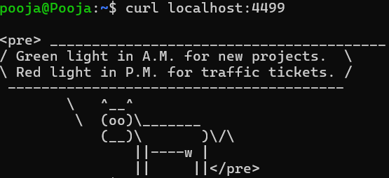
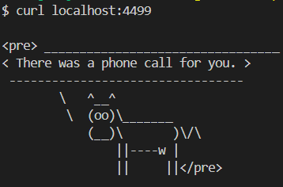

# Problem Statement 1:  Containerisation and Deployment of Wisecow Application 

## 🧠 Step 1. Understand Wisecow App

The app serves random "wisdom" via a simple HTTP response using:

* **fortune** and **cowsay** commands.
* **nc (netcat)** to serve HTTP responses.

It listens on **port 4499**.

You can test locally:

```bash
chmod +x wisecow.sh
./wisecow.sh
# In another terminal:
curl localhost:4499
```

**Output:**



If you see a cow ASCII art with text, it works ✅

---

## 🐳 Step 2. Dockerize the Application

We’ll create a Docker image that installs dependencies and runs `wisecow.sh`.

### 📄 Create file: `Dockerfile`

### ✅ Test the image

From your Git Bash (inside `PS-1`):

```bash
docker build -t wisecow-app .
docker run -d -p 4499:4499 wisecow-app
curl localhost:4499
```

**Output:**



---

## ☸️ Step 3. Kubernetes Deployment

### 📂 Create folder: `k8s`

Inside it, create the following files.

---

### 📄 `deployment.yaml`

### 📄 `service.yaml`

### 📄 `ingress.yaml` (for TLS)

```bash
kubectl config use-context docker-desktop
kubectl cluster-info
```

### 🧪 Apply the manifests

```bash
kubectl apply -f k8s/
kubectl get pods,svc,ingress
```

You should see:
* Pod running
* Service (NodePort)
* Ingress ready

---

## 🔐 Step 4. Enable TLS with Self-Signed Certificate

### Generate certs

```bash
openssl req -x509 -nodes -days 365 -newkey rsa:2048 \
  -keyout tls/tls.key -out tls/tls.crt -subj "//CN=wisecow.local/O=wisecow"

```

### Create secret

```bash
kubectl create secret tls wisecow-tls --cert=tls/tls.crt --key=tls/tls.key
```

Verify:

```bash
kubectl get secrets
```

Now, update `/etc/hosts` (local testing):

```
127.0.0.1 wisecow.local
```

Then test:

```bash
curl -k https://wisecow.local
```

---

## ⚙️ Step 5. CI/CD with GitHub Actions

We’ll automate Docker image build & push, and optionally redeploy to K8s.

---

### 📂 Folder: `.github/workflows/`

Create file: `ci-cd.yaml`

### 🧩 GitHub Secrets (Settings → Secrets → Actions)

Add:

* `DOCKER_USERNAME`
* `DOCKER_PASSWORD`
* (Optional) `KUBE_CONFIG_DATA` if using GitHub runner to connect to remote K8s cluster.

---

### 🧪 Test the workflow

1. Commit and push to GitHub.
2. Go to **Actions tab** → monitor workflow.
3. After success, check DockerHub → your image should be updated.

Take screenshots:

* GitHub Actions success
* DockerHub repository

---
