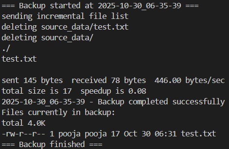
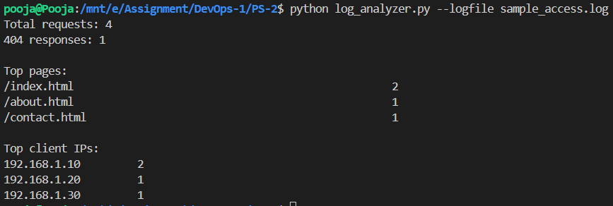

# Problem Statement 2

1. System Health Monitoring Script: 
Develop a script that monitors the health of a Linux system. It should check CPU usage, memory usage, disk space, and running processes. If any of these metrics exceed predefined thresholds (e.g., CPU usage > 80%), the script should send an alert to the console or a log file. 

2. Automated Backup Solution: 
Write a script to automate the backup of a specified directory to a remote server or a cloud storage solution. The script should provide a report on the success or failure of the backup operation. 

3. Log File Analyzer: 
Create a script that analyzes web server logs (e.g., Apache, Nginx) for common patterns such as the number of 404 errors, the most requested pages, or IP addresses with the most requests. The script should output a summarized report.

4. Application Health Checker: 
Please write a script that can check the uptime of an application and determine if it is functioning correctly or not. The script must accurately assess the application's status by checking HTTP status codes. It should be able to detect if the application is 'up', meaning it is functioning correctly, or 'down', indicating that it is unavailable or not responding.

